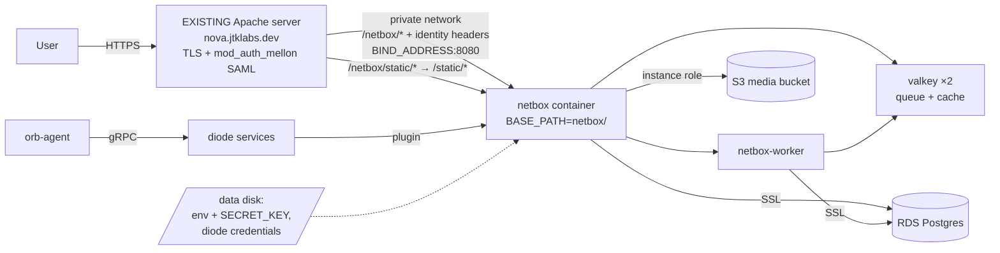

# NetBox @ nova.jtklabs.dev/netbox — Project Plan

Status: Gates **1, 2, 2.5, 3 complete** (dev stack, plugins, quotes plugin, discovery — all verified against real hardware) · Gates **4 & 5 built and rehearsed in dev** · All §8 inputs answered; the only thing outstanding is EC2/AMI access to run the live deploy, which is Jason-executed via docs/FIRST-BOOT.md · Last updated: 2026-08-04

A single-repo, env-driven NetBox deployment: dev first (local containers, local accounts), then prod (Ubuntu 24 EC2, RDS Postgres, S3, Apache + mod_auth_mellon SAML, 30-day AMI redeploy cycle). All version claims below were verified against live sources on 2026-07-28.

---

## 1. Goals & constraints (recap)

- NetBox deployed on Ubuntu 24 EC2; **AMI is rebuilt/redeployed every 30 days** (compliance), so the app node must be disposable and rebuild itself unattended.
- Prod database on existing **Postgres RDS**; **S3** available; a **data disk** is detached/reattached across redeploys.
- **SSO in prod via an EXISTING Apache + mod_auth_mellon server** (a separate host that already serves nova.jtklabs.dev and injects the identity headers). The NetBox instance runs neither Apache nor Mellon. Dev uses local accounts.
- Served at **https://nova.jtklabs.dev/netbox** (subpath) behind the existing Apache that fronts the Nova app. Nova consumes NetBox data via API; nothing needed on our side beyond a stable API endpoint.
- **Device discovery** for the existing network — open-source path required.
- Plugins: originally a **contracts manager** and **lifecycle** plugin. Both third-party choices were later replaced by plugins we own — see D9 and D10.
- One repo; dev vs prod differ only by env/compose selection.

## 2. Decisions (ADR-style)

### D1 — Docker via netbox-docker, not bare metal ✅ recommended
The 30-day AMI cycle is the deciding factor: with Docker the app is a pinned image + config, so a fresh instance only needs `docker compose up`. Bare metal means re-running a multi-step install (Python venv, systemd units, migrations) on every AMI cycle and drift-prone parity between dev (your Mac) and prod. netbox-docker is the community-maintained official-adjacent image with well-trodden plugin, external-DB, and SSO-header patterns. Dev/prod parity becomes an env-file difference, which is exactly what you asked for.

### D2 — Pin NetBox 4.6.x ✅ spike passed 2026-07-28
`netbox-contract`'s declared matrix tops out at 4.5, so we ran the compatibility spike immediately (rather than waiting for Gate 2): full dev stack on **v4.6.5** with `netbox-contract` 2.4.6 + `netbox-lifecycle` 1.1.9. Result: **pass** — clean install, all 43 + 18 plugin migrations applied, `manage.py check` clean, every no-arg plugin page (list/add/API) returns 200, contract + invoice created via REST API, all detail pages render, worker healthy. Current pin is **v4.6.5-5.0.2** (the v4.6.6 image wasn't published yet on spike day — NetBox 4.6.6 released that morning; bump when the image lands). Side benefit: being on ≥4.6 means the *latest* Diode NetBox plugin is usable at Gate 3.
One version-independent quirk found: netbox-contract's invoice API serializer requires the `template` field in POST bodies (`data['template']` KeyError if omitted) — candidate for an upstream issue; noted in §9.

### D3 — Discovery: orb-agent + Diode (the "NetBox Discovery community path") — no license needed
Your instinct was right. NetBox Discovery is not one licensed product: the **orb-agent** (does the actual scanning: Nmap network sweep, NAPALM/SSH device discovery, SNMP backend) is **Apache-2.0 open source**, and **Diode** (the ingestion service + NetBox plugin that reviews/applies discovered data as changesets) is **source-available (NetBox Limited Use License 1.0)** — explicitly free for self-hosted community NetBox internal use, no subscription. What the license buys on Cloud/Enterprise is the *managed* Diode + orchestration console; the self-deploy path is officially documented. Both repos are very active (releases June–July 2026).
Fallbacks if Diode proves heavy (~4–6 extra containers): **Slurp'it free tier** for one-time initial onboarding (unlimited discovery/onboarding, but 10-device cap on ongoing deep collection), or custom Nornir/NAPALM collectors pushed through the Apache-2.0 `diode-sdk-python`. Decision confirmed/revised at Gate 3.

### D4 — Prod media on S3; data disk for secrets/state ✅ recommended
NetBox media (image attachments, uploads) goes to **S3** via Django `STORAGES` — django-storages + boto3 are already in the netbox-docker image, and on EC2 an instance-profile role means no S3 keys in config at all. This makes the instance fully stateless: DB in RDS, media in S3. The **data disk** then carries only the prod env files (SECRET_KEY, API token pepper, RDS/S3 settings, discovery credentials) and the Diode client credentials. SAML material lives on the Apache server, not here. Alternative (if you'd rather avoid S3): bind-mount media onto the data disk — supported, env-switchable, decide at Gate 0.

### D5 — SSO: the existing remote Apache terminates SAML, NetBox trusts a header
Prod Apache (mod_auth_mellon) runs on a **separate, already-deployed server** and proxies to the NetBox instance over the private network. It authenticates, then injects `X-Remote-User` into the proxied request; NetBox's built-in remote-auth middleware (`REMOTE_AUTH_ENABLED=true`, `REMOTE_AUTH_HEADER=HTTP_X_REMOTE_USER`, auto-create users, optional group sync from a groups header) does the rest. All of these are env vars out of the box in netbox-docker. Apache must unconditionally set/unset the header so clients can't spoof it. Dev: remote auth off, local superuser bootstrap via env. Local accounts remain a break-glass fallback in prod.

### D6 — Valkey/Redis stays in-container, even in prod
It's cache + job queue only (transient data). netbox-docker ships two Valkey 9.1 containers; losing them on redeploy costs at most in-flight background jobs during the maintenance window. No ElastiCache needed.

### D7 — App version cadence is decoupled from the AMI cadence
The 30-day AMI redeploy does **not** force a NetBox upgrade. Images are pinned by tag; a fresh AMI comes up on the same pinned versions. Upgrades are a deliberate, runbooked act (bump pins → dev → prod), naturally scheduled into an AMI window when convenient. This protects us from the classic failure mode: plugin lags NetBox release, forced upgrade breaks prod.

### D9 — Custom `netbox_quotes` plugin; netbox-contract dropped (2026-07-29)
Requirement: vendor support-renewal quotes with an attached document and per-line pricing, where each line carries a serial that auto-attaches to the Device/Module/InventoryItem holding that serial (manual assignment fallback; component lines roll up to their device). Verified nothing existing covers this (netbox-contract's InvoiceLine has no device link/serial; netbox-lifecycle has assignments but zero money fields; netbox-inventory/CESNET/NetBox Labs Asset Lifecycle all miss the shape — see research 2026-07-28). So we own a small plugin: `plugins/netbox-quotes` in this repo, models QuoteVendor ("Vendor" in UI; class renamed to avoid a reverse-accessor clash with netbox_lifecycle.Vendor) / Quote (with FileField document → S3 in prod) / QuoteLine (serial, pricing, coverage dates, GFK assignment, match_state auto/manual/unmatched/ambiguous). Serial matching is case-insensitive and treats duplicate-serial hits as `ambiguous` (NetBox doesn't enforce serial uniqueness). One serial per line; the same serial may appear on multiple lines. **netbox-contract is dropped** — the quotes plugin covers the real need, and it removes our only NetBox-version-lagging dependency.

### D10 — Own the hardware lifecycle domain; netbox-lifecycle removed (2026-07-31)
Requirement: EoL dates on hardware models *and* components, a link to the replacement model, a per-model replacement cost, and a report answering "what goes end of life between X and Y, and what will replacing it cost" — with Cisco EoX auto-population and manual entry for everything else. Researched adopt-vs-build first: three Cisco EoL plugins exist and none work (one stores nothing so you cannot filter or report, one is dead since 2021, the maintained one has no findable source), and **nothing in the ecosystem — open source or commercial — models a replacement link or per-model cost**. NetBox Labs' Asset Lifecycle is procurement, not EoL, and is not self-hostable yet.
Decision: build `plugins/netbox-refresh` owning the whole domain, and **remove netbox-lifecycle** rather than extending it (Jason's call — avoids coupling to a plugin whose feature work has stalled, and avoids two EoL stores). Its tables were dropped with `migrate netbox_lifecycle zero` while it still had zero records.
Note for the 4.7 upgrade: NetBox 4.7 adds a native `DeviceType.end_of_life` / `ModuleType.end_of_life` date (PR #22634, merged, unreleased). That will overlap our `end_of_support`. Plan is to keep ours authoritative (it carries the full Cisco date set, not one field) and optionally mirror into the core field.

### D11 — No ECR; the image is baked into the AMI (2026-07-29)
No container registry is available, so `PROD_IMAGE` stays unset and `compose/prod.yml` refers to a local tag. `scripts/prod-build.sh` builds that tag and then verifies every plugin imports inside the built image, so a plugin that would fail on boot is caught during the bake rather than during a redeploy. Add it as one step to the monthly AMI bake; `deploy/bootstrap.sh` builds at first boot as a fallback (~5 minutes slower). A boot therefore needs no registry at all, which also removes Docker Hub rate limits from the redeploy path.

### D8 — Single repo, env-file driven
One repo holds: a pinned import of netbox-docker's support files, our plugin Dockerfile, `configuration/` overrides, per-env env files, compose overlays, Apache snippets, discovery config, and deploy/bootstrap scripts. Selecting dev vs prod = choosing the env file + compose overlay (`COMPOSE_FILE`/profiles). Secrets never committed; prod secrets live on the data disk (SSM Parameter Store as a later hardening option).

## 3. Version pins (Gate 0 lock)

| Component | Pin | Notes |
|---|---|---|
| NetBox | **v4.6.5** (→ 4.6.6 when its image publishes) | Spike-verified with both plugins 2026-07-28. |
| netbox-docker | image `v4.6.5-5.0.2`, support files tag `5.0.2` | Imported into repo; see VERSIONS.md. |
| netbox-quotes | **0.1.0** (ours, `plugins/netbox-quotes`, plugin `netbox_quotes`) | Custom quotes/serial-matching plugin (D9). Installed into the image from the repo. |
| netbox-lifecycle | **1.1.9** (PyPI `netbox-lifecycle`, plugin `netbox_lifecycle`) | Spike-verified on 4.6.5. Maintainer is a NetBox core dev. |
| ~~netbox-contract~~ | dropped 2026-07-29 | Superseded by netbox-quotes (D9); was our only version-lagging dependency. |
| Diode services | 2.1.x (ingester/reconciler/auth) | Gate 3. |
| diode-netbox-plugin | latest 1.12.x | Requires NetBox ≥ 4.6 — satisfied by our pin. Final pin at Gate 3. |
| orb-agent | 2.11.x | Apache-2.0, Docker Hub `netboxlabs/orb-agent`. |
| Postgres (dev container) | match RDS major (15–17 recommended) | NetBox 4.6 min is PG 14 (deprecated); 4.7 will require 15+. **Confirm RDS engine version.** |
| Valkey | 9.1-alpine (as shipped) | Two instances: queue (DB 0) + cache (DB 1). |

## 4. Architecture

### Dev (your Mac / any Docker host)
`docker compose` up: netbox + netbox-worker (custom plugin image) + postgres + valkey ×2. Direct access on `127.0.0.1:8080`, no subpath, local superuser from env. Optional `proxy` overlay adds a tiny Caddy/Nginx that mimics prod's `/netbox` subpath + static mapping so we can rehearse the prod topology (used from Gate 4 on). Discovery adds diode + orb-agent containers (Gate 3).

### Prod (Ubuntu 24 EC2, rebuilt every 30 days)



Nova reads NetBox via the REST/GraphQL API at `https://nova.jtklabs.dev/netbox/api/` with a service token.

## 5. Repo layout (target)

```
Netbox/
├── PROJECT_PLAN.md              # this file
├── VERSIONS.md                  # every pin + upstream tag we imported, with dates
├── .env.example                 # selects env: COMPOSE_FILE chain, ENV_FILE
├── docker-compose.yml           # base (imported from netbox-docker @ pinned tag, adapted)
├── compose/
│   ├── dev.yml                  # local postgres, ports, superuser bootstrap
│   ├── prod.yml                 # no postgres svc, RDS/S3 env, restart policies
│   ├── dev-proxy.yml            # dev HTTPS proxy serving /netbox, the prod path
│   └── discovery.yml            # diode + orb-agent
├── Dockerfile-Plugins           # FROM netboxcommunity/netbox:<pin>; uv pip install; collectstatic
├── plugin_requirements.txt      # netbox-contract==2.4.6, netbox-lifecycle==1.1.9, (diode plugin)
├── configuration/               # mounted at /etc/netbox/config (read-only)
│   ├── plugins.py               # PLUGINS + PLUGINS_CONFIG
│   └── extra.py                 # env-driven: BASE_PATH, STORAGES(S3), DB SSL extras
├── env/
│   ├── dev.env                  # committed, no real secrets
│   └── prod.env.example         # committed template; real prod.env lives on data disk
├── apache/
│   └── netbox.conf              # include for the EXISTING Apache server: protects /netbox,
│                                # strips spoofed identity headers, proxies + static map
├── discovery/
│   ├── agent-policy.yaml        # orb-agent scan policies (subnets, drivers)
│   └── README.md                # adding devices/subnets, credential handling
├── deploy/
│   ├── bootstrap.sh             # idempotent: mount data disk, link env, compose up
│   ├── user-data.sh             # cloud-init hook → bootstrap.sh
│   └── netbox-compose.service   # systemd unit (up on boot, down on shutdown)
└── docs/
    ├── RUNBOOK-redeploy.md      # the 30-day drill
    ├── RUNBOOK-upgrade.md       # version bump procedure
    └── RUNBOOK-restore.md       # DB/media restore
```

## 6. Gates

Each gate ends with a demo + your sign-off before we proceed. Effort is in working sessions (a focused block, not days).

---

### Gate 0 — Plan approved & inputs gathered (this gate)
**You check:** this plan, the decisions D1–D8, the pins table, and the open questions in §8.
**Exit criteria:**
- [ ] D1–D8 approved or amended
- [ ] RDS engine version confirmed (and PG 15+ upgrade path if it's 14)
- [ ] S3-for-media confirmed (or data-disk media chosen)
- [x] SAML details identified — the existing Apache already injects the full header set (answered 2026-07-29)
- [ ] Discovery scope sketched: subnets to scan, device credential types (SNMP community / SSH), where creds will live

### Gate 1 — Dev stack up (effort: 1 session)
**Scope:** git init; import netbox-docker support files at the pinned tag (recorded in VERSIONS.md); `Dockerfile-Plugins` builds with both plugins installed; compose dev overlay; env scaffolding; superuser bootstrap; smoke test.
**Exit criteria:**
- [ ] `docker compose up` from a clean checkout yields a healthy NetBox at `http://127.0.0.1:8080`
- [ ] Login with env-defined local superuser; create a Site + Device via UI
- [ ] API token works: `GET /api/dcim/devices/` returns the device
- [ ] Rebuild-from-nothing proven: `docker compose down -v` + fresh up + restore path documented

### Gate 2 — Plugins validated + 4.6 decision (effort: 1 session)
**Scope:** enable/configure both plugins; seed sample data; document the overlap (netbox-lifecycle has its own SupportContract model vs netbox-contract's invoicing-grade contracts — we'll set a convention: **netbox-contract = commercial/financial contracts & invoices; netbox-lifecycle = hardware EoL/EoS, licenses, support coverage**).
**Exit criteria:**
- [x] Migrations clean; both plugins visible and usable; sample contract + invoice + sample EoL record on a DeviceType *(done during the 2026-07-28 spike)*
- [ ] Convention note committed (which plugin owns what)
- [x] 4.6 spike verdict recorded → final prod pin decided: **4.6.x** *(passed 2026-07-28)*

### Gate 2.5 — Quotes plugin v1 (effort: 2 sessions, then polish)
**Scope:** build `netbox_quotes` per D9 — models + migrations, UI (list/detail/edit/import views, quote-page lines table with re-match action, device-page renewals card), REST API (incl. `?device_id=` rollup filter for Nova), serial auto-match engine, quote document upload.
**Exit criteria (all verified 2026-07-29 in dev):**
- [x] Auto-match: line with a known device serial attaches itself on create/import (incl. case-insensitive)
- [x] Component rollup: line matched to an inventory item appears on the parent device's renewals card and in `?device_id=` API results
- [x] Ambiguous + unmatched serials flagged, manually assignable (UI selector + API); manual assignments survive re-matching
- [x] Quote document uploads and downloads
- [x] CSV bulk import of lines works, with auto-match on import
- [x] Device deletion clears its line assignments back to unmatched
- [x] Module rollup verified with a real module (bay + type + install); renewals card added to module pages too (2026-07-29)
- [x] Jason's hands-on look: switches + device view confirmed good

### Gate 3 — Discovery working in dev (effort: 1–2 sessions)
**Scope:** add diode services + diode-netbox-plugin (version matching our NetBox pin) + orb-agent via `compose/discovery.yml`; write an agent policy scanning a real test subnet/device from your network; ingest → review → apply changesets in NetBox.
**Exit criteria (verified 2026-07-29 in dev against real hardware):**
- [x] device_discovery (NAPALM/ios over SSH) **and** snmp_discovery (SNMPv3 authPriv) both pulled the test switch 10.0.21.101 into NetBox via Diode: TRUNK_SW_BLUE, exact model WS-C2960-24PC-S, **real serial FCQ1718X3MW**, platform string, 30 interfaces, both IPs incl. primary
- [x] Synergy proven: a quote line with the discovered serial auto-matched to the discovered device (discovery feeds the quotes plugin with zero manual linking)
- [x] Credential handling: device + SNMP creds only in gitignored `.env` (`DISCOVERY_*`); OAuth secrets generated by init script; agent.yaml is committed and secret-free (`${VAR}` substitution)
- [x] Runbook: `discovery/README.md` (add subnets/devices, rescan = restart agent, troubleshooting, gotchas)
- [x] Diode accepted (fallbacks not needed). **Finding:** OSS reconciler auto-applies changesets — the browsable review queue is commercial-only; the OSS review path, if ever wanted, is the `netbox-branching` plugin (documented in the runbook)
- [ ] network_discovery (nmap subnet sweep) — deferred until a subnet target is nominated; policy pattern documented in the runbook
- [ ] Your sign-off

### Gate 4 — Prod profile: RDS, S3, subpath, SSO (artifacts built + rehearsed 2026-07-29; live deploy awaiting inputs)
**Built:** `compose/prod.yml`, `env/prod.env.example`, env-gated `configuration/extra.py` (BASE_PATH, S3 STORAGES via instance role), `apache/netbox.conf` (mellon + spoof-proof header + static mapping + logout note), dev rehearsal via `compose/dev-proxy.yml`, which now doubles as the everyday dev proxy (HTTPS, `/netbox`, optional SSO simulation) so the prod topology is exercised continuously rather than only in a drill. Base compose restructured: postgres is now dev-only (`compose/dev.yml`) since overlays can't remove services — prod simply never defines it.
**Exit criteria:**
- [x] Dev rehearsal PASSED: NetBox fully functional under `/netbox` behind the dev proxy — styles load via the static mapping, quotes-plugin pages and API work under the subpath, header SSO auto-creates the user, client-supplied identity headers are overwritten (spoof-proof)
- [x] **Finding:** auto-created SSO users have zero permissions by default — first admin must be granted (one-time `is_superuser` grant, or `REMOTE_AUTH_SUPERUSER_GROUPS` once the IdP sends a groups header; noted in prod.env.example)
- [ ] Prod-like instance: real SAML round-trip *(needs: IdP metadata + username attribute, EC2 target)*
- [ ] Local-account break-glass login verified in prod
- [ ] Media upload lands in S3; RDS over SSL confirmed *(needs: bucket + RDS answers)*
- [ ] Nova calls `https://nova.jtklabs.dev/netbox/api/` with a token

### Gate 5 — 30-day redeploy automation (artifacts built 2026-07-29; drill awaiting EC2)
**Built:** `deploy/bootstrap.sh` (idempotent: mount-by-label `NETBOXDATA`, secrets linked from `/mnt/data_disk/netbox-secrets`, image pull-or-build, health gate on the published address), `deploy/user-data.sh`, `deploy/netbox-compose.service`, and `docs/RUNBOOK-redeploy.md` / `RUNBOOK-upgrade.md` / `RUNBOOK-restore.md`. Bootstrap intentionally refuses to invent prod secrets — SECRET_KEY/pepper must be created once on the data disk (documented in the script header).
**Exit criteria:**
- [x] Bootstrap + user-data + systemd unit written and syntax-checked; secrets persistence design (SECRET_KEY/pepper/diode credentials on the data disk) documented
- [x] Runbooks: redeploy drill, monthly pin-bump (incl. plugin-compat gate + NetBox 4.7 PG15 warning), restore
- [ ] **The drill on real EC2:** fresh AMI → healthy at `https://…/netbox`, zero manual steps, time recorded *(needs: EC2/AMI pipeline access)*
- [ ] Sessions survive a real redeploy
- [ ] Restore fire-drill exercised once

### Gate 6 — Production cutover (effort: 1 session)
**Scope:** real prod deploy, Apache config live on nova.jtklabs.dev, first discovery run against the production network, monitoring hook (healthcheck endpoint → whatever you use), docs pass.
**Exit criteria:**
- [ ] Prod live at https://nova.jtklabs.dev/netbox behind SSO
- [ ] Discovery populated real devices; data reviewed/applied
- [ ] All runbooks final; VERSIONS.md accurate; handoff walkthrough done

---

## 7. Risks & watch items

| Risk | Mitigation |
|---|---|
| netbox-contract lags NetBox releases (declared matrix behind) | D7 decoupling; we run our own spike before any NetBox bump (proven cheap on 2026-07-28); only bump when both plugins verify. |
| Subpath (`BASE_PATH`) breakage — esp. plugin pages, static files | netbox-docker removed the easy env var for a reason; §9 has the exact recipe; dev now runs behind the same subpath continuously, so regressions surface immediately. |
| Docker Hub rate limits / registry outage at 30-day boot time | Image is baked into the AMI by `scripts/prod-build.sh` (no ECR — D11), so a boot needs no registry. |
| Header-spoofing of `X-Remote-User` | Apache `RequestHeader unset` inbound + set from MELLON var only; NetBox only reachable via loopback proxy (no public port). |
| Queue jobs lost during redeploy window | Redeploy in a maintenance window; jobs are re-runnable (housekeeping, discovery ingests re-sync). |
| SAML logout ≠ NetBox logout | Wire NetBox logout redirect → `/mellon/logout`; document session behavior at Gate 4. |
| Discovery credentials sprawl | Single creds file on data disk, referenced by agent config; SSM Parameter Store as hardening follow-up. |

## 8. Open questions (answer at Gate 0)

1. ~~RDS~~ **Answered 2026-07-29: PostgreSQL 16.13** — above the 4.6 floor and already satisfies NetBox 4.7's PG 15+ requirement. Dev postgres pinned to 16-alpine for parity.
2. ~~Media~~ **Answered 2026-07-29: S3.** (Bucket name goes in Jason's own prod.env.)
3. ~~SAML~~ **Answered 2026-07-29:** existing Mellon already injects X-Remote-User, X-User-AD-Username, X-User-Email, X-UserFirstName, X-User-LastName, X-User-FullName, X-User-Groups. Full mapping incl. group sync wired into prod.env.example; group separator to be verified at first prod login (default `|`).
4. **Discovery**: first target subnet(s) and device credential types (SSH? SNMP v2c/v3?); vendor mix (drives NAPALM driver choice)?
5. ~~Image distribution~~ **Answered 2026-07-29: no ECR.** Image is built during the monthly AMI bake (docs/FIRST-BOOT.md), bootstrap local-build as fallback; `PROD_IMAGE` stays unset.
6. **Apache ownership**: do I own the vhost include in this repo and you drop it into the existing Apache config, or is Apache managed elsewhere (Ansible/etc.)?
7. **Maintenance window**: is there an accepted window for the 30-day redeploy (affects how much we care about queue draining)?

## 9. Appendix — verified implementation facts (so we don't re-research)

These were verified 2026-07-28 against current repos/docs; they're the sharp edges the implementation must honor.

- **BASE_PATH**: netbox-docker intentionally provides **no env var** for it — set `BASE_PATH = 'netbox/'` in `configuration/extra.py` (all `.py` in the mounted `configuration/` dir auto-load; later files override `configuration.py`).
- **Static files under subpath**: the container's Granian launcher hardcodes serving `/static` (not `/netbox/static`). Apache must map, in this order:
  ```apache
  ProxyPass /netbox/static/ ${NETBOX_BACKEND}/static/
  ProxyPass /netbox/ ${NETBOX_BACKEND}/netbox/
  ```
  Do **not** strip `/netbox` on app routes — Django expects the prefix when BASE_PATH is set.
- **Healthcheck**: compose default curls `/login/` → 404 under BASE_PATH; override to `/netbox/login/`.
- **Ports**: base compose publishes none; add `127.0.0.1:8080:8080` in our overlay (loopback-only in prod, Apache proxies).
- **Remote auth env vars (all supported by netbox-docker out of the box)**: `REMOTE_AUTH_ENABLED`, `REMOTE_AUTH_BACKEND=netbox.authentication.RemoteUserBackend` (default; there is no `HTTPRemoteUserBackend`), `REMOTE_AUTH_HEADER=HTTP_X_REMOTE_USER` (WSGI META name for header `X-Remote-User`; use hyphens on the wire — some servers drop underscore headers), `REMOTE_AUTH_AUTO_CREATE_USER`, `REMOTE_AUTH_USER_EMAIL/FIRST_NAME/LAST_NAME`, group sync: `REMOTE_AUTH_GROUP_SYNC_ENABLED`, `REMOTE_AUTH_GROUP_HEADER` (default `HTTP_REMOTE_USER_GROUP`), `REMOTE_AUTH_GROUP_SEPARATOR` (`|`), `REMOTE_AUTH_SUPERUSER_GROUPS`, `REMOTE_AUTH_STAFF_GROUPS`. Only `REMOTE_AUTH_DEFAULT_PERMISSIONS` (a dict) needs `extra.py`.
- **Apache header injection (spoof-proof shape)**:
  ```apache
  RequestHeader unset X-Remote-User
  RequestHeader set X-Remote-User %{MELLON_uid}e env=MELLON_uid
  ```
- **S3 media**: NetBox 4.x uses the Django `STORAGES` dict (`default` key = media) with `storages.backends.s3.S3Storage`; **django-storages[boto3] is already in the image** — no custom pip install; on EC2 omit keys and boto3 uses the instance role. Configure in `extra.py`, env-gated (e.g. only if `S3_MEDIA_BUCKET` set → dev keeps local volume).
- **External DB env**: `DB_HOST/PORT/NAME/USER/PASSWORD`, `DB_SSLMODE` (set `require` for RDS; `verify-full` additionally needs `sslrootcert` via `extra.py`), `DB_CONN_MAX_AGE`. Drop the `postgres` service in the prod overlay.
- **CSRF/hosts**: `CSRF_TRUSTED_ORIGINS=https://nova.jtklabs.dev` (space-separated, scheme required), `ALLOWED_HOSTS`.
- **Plugins pattern**: `Dockerfile-Plugins` → `FROM netboxcommunity/netbox:<exact-tag>`; `COPY plugin_requirements.txt`; `RUN /usr/local/bin/uv pip install -r …`; then `collectstatic --no-input` with a dummy SECRET_KEY; point `netbox` **and** `netbox-worker` services at the built image.
- **Superuser bootstrap (dev)**: `SKIP_SUPERUSER=false` + `SUPERUSER_NAME/EMAIL/PASSWORD` (+ `SUPERUSER_API_TOKEN`); no default credentials in current images.
- **NetBox 4.6+ note for the future bump**: v2 API tokens require `API_TOKEN_PEPPER_1` env/secret — without it token creation fails; netbox-docker 5.0.0+ images are the 4.6-era line (Granian server since 4.0.0; container user is `netbox`).
- **Postgres floor**: NetBox 4.6 requires PG 14+ (14 deprecated); 4.7 will require 15+. Valkey 9.1 ships as two services (queue DB 0 w/ AOF, cache DB 1).
- **netbox-contract**: dropped 2026-07-29 (D9). Historical spike note: it worked on 4.6.5 but its invoice API required an explicit `"template": false` in POST bodies.
- **Plugin dev gotchas learned**: NetBox blocks `makemigrations` unless `DEVELOPER=true` is set; two plugins must not define identically-named model classes (users.Owner reverse accessors clash — hence QuoteVendor); generate plugin migrations by bind-mounting the repo package over the installed site-packages copy in a `docker compose run`.
- **Discovery stack**: orb-agent = Apache-2.0, container `netboxlabs/orb-agent`, YAML policies, backends: `network_discovery` (Nmap), `device_discovery` (NAPALM), `snmp_discovery`, `gnmi_discovery` (beta). Diode = ingester/reconciler/auth containers + `netboxlabs-diode-netbox-plugin` (NLUL 1.0 source-available license — free for internal self-hosted use; flag only if procurement demands strict OSI). Compose quickstart exists. Diode requires NetBox ≥ 4.2.3; latest plugin targets ≥ 4.6.

## 10. Source links

netbox-docker: https://github.com/netbox-community/netbox-docker (+ wiki: Using Netbox Plugins) · NetBox docs: https://netboxlabs.com/docs/netbox/ (configuration/system#base_path, configuration/remote-authentication, configuration/system#storages) · netbox-contract: https://github.com/mlebreuil/netbox-contract · netbox-lifecycle: https://github.com/DanSheps/netbox-lifecycle · orb-agent: https://github.com/netboxlabs/orb-agent · Diode: https://github.com/netboxlabs/diode · Diode licensing statement: https://netboxlabs.com/blog/expanding-and-sustaining-our-investments-in-netbox-how-were-approaching-licensing-for-some-netbox-add-ons/ · Discovery community path: https://netboxlabs.com/docs/discovery/getting-started/ · Slurp'it: https://slurpit.io/pricing/
